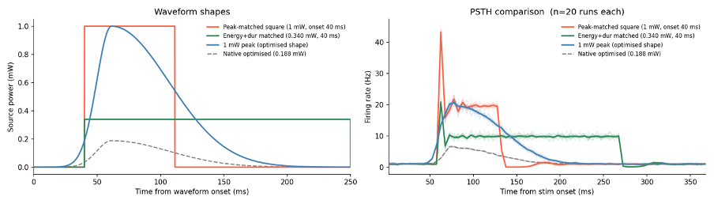

Here's a brief overview of some of my ongoing research projects.

---

### **Project 1: Neural representations in dmFC and RNNs**

**Duration:** 2026 – Present  
**Status:** Ongoing

In this project, I aim to uncover the representations enabling value-based decision-making in dmFC through a combination of neural data analysis and neural network-based modelling. I analyse calcium imaging recordings from dmPFC of mice performing a visual Pavlovian reversal learning task to identify the representations encoding variables such as stimulus identity, value and context (reversal phase). I take multiple approaches such as targeted dimensionality reduction to explicitly find task-relevant subspaces and selectivity-based analysis to define functional subpopulations of neurons, and decoding to ask which variables are present and whether they are conserved following changes to reward contingency. I then train RNNs to perform an analogous task and analyse the resulting representations. I am particularly interested in is how different learning rules shape the representations and whether aligning the model representations to the experimental data can teach us about learning in dmFC. To investigate this, I train variants of RNNs whose hidden representations are learned through reinforcement learning, self-supervised learning, and their combination. I then compare the resulting representations to the experimental data using statistical goodness-of-fit tests and representational similarity analysis.

*Model architectures.*

*Model performance, representational stability, cross-phase generalisation accuracy*

*Comparing subspaces for context, value, stimulus in different models.*

*Comparisons between neural data and model representations.*

This project is a work in progress. I am currently focussed on a retrospective form of self-supervised learning, and focussed on this particularly simple task. However, in the next stages of the project, I plan to extend this to predictive self-supervised learning on a wider range of tasks (including those which require learning state transition model to successfully obtain reward). 

**Technologies/Methods:** RNNs; reinforcement learning; linear decoding; dynamical systems analysis; activation steering; ablations; reinforcement learning; linear decoding; dynamical systems analysis; activation steering; ablations.

---

### **Project 2: Designer waveform**

**Duration:** 2026 - Present
**Status:** Ongoing

Typical optogenetic stimulation protocols do not produce the same population-level activity as natural sensory input, partially due to strong synchronous stimulation. In this project, I am developing tools to find stimulation waveforms that evoke more naturalistic activity. Given a target population response (e.g. a PSTH recorded during natural stimulation), it searches the space of parametric waveforms to find the stimulus shape that drives a neural population model towards that target. On each optimisation step, the waveform is fed as input to a spiking neural network model of a representative population of V1 neurons (with multiple possible opsins), the simulated population activity is stored, the error from the target is computed and stored as a scalar objective function, and the waveform parameters are updated. This is repeated to minimise the objective function until a convergence criterion is reached.

These waveforms are being used within a stimulus detection reporting task which includes both natural and artificial stimuli, and we are currently using them to ask a simple question: will the report rate be closer to that of natural images for the model-optimised waveforms than standard square waveforms. In other words, without the priveledge of full control over the neural population (as we would get from holographic stimulation), but only 

*An example of a ground-truth stimulus-evoked PSTH derived from the Allen Visual Coding Neuropixels dataset, and the activity for the model-optimised waveforms for two opsins: C1V1 and ChRmine.*

*Left: model-optimised waveform and control square stimulation waveforms. Right: Model responses to these three waveforms.*

The code for this project can be found at <https://github.com/pmccthy/designer-waveform>.

This project is a work in progress. We are currently testing the first model-optimised waveforms _in vivo_. In the next stages of this project, we will explore strategies to optimise parameters for holographic two-photon stimulation, in which we have control over single neurons and will be optimising for a target activity vector rather than simultaneously stimulating all neurons.

**Technologies/Methods:** Spiking neural networks; gradient-free optimisation; electrophysiological data analysis.
